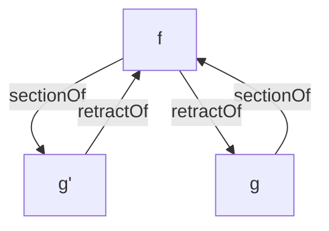

Parent: [[lan/2026/topic/study-math/000 CQTS Intro to Cubical/wikiproc/000 Wiki Proc CQTS Intro to Cubical/000 Wiki Proc CQTS Intro to Cubical]]

Spawned by: [[lan/2026/topic/study-math/000 CQTS Intro to Cubical/wikiproc/000 Wiki Proc CQTS Intro to Cubical/entry/001 Proc CQTS retract equiv]]

Spawned in: [[lan/2026/topic/study-math/000 CQTS Intro to Cubical/wikiproc/000 Wiki Proc CQTS Intro to Cubical/entry/001 Proc CQTS retract equiv#^spawn-invst-acfdc3|^spawn-invst-acfdc3]]

Errata: [[003 Errata CQTS How do we interpret retract and section?]]

Overview: [[000 Overview Wiki Proc CQTS Intro to Cubical]]

# Journal

2026-06-17 Wk 25 Wed - 12:30 +03:00

Spawn [[003 Errata CQTS How do we interpret retract and section?]] ^spawn-entry-71d2d9

2026-06-17 Wk 25 Wed - 11:26 +03:00

Some reminders on sections and retracts from the text,
A → B
```haskell
isSection : {A : Type ℓ} {B : Type ℓ'}
  → (f : A → B) 
  → (g : B → A)
  → Type ℓ'
isSection {B = B} f g = (b : B) → f (g b) ≡ b

record SectionOf {A : Type ℓ} {B : Type ℓ'} (f : A → B) : Type (ℓ-max ℓ ℓ') where
  constructor sectionData
  field
    map : B → A
    proof : isSection f map
	
record _RetractOnto_ (A : Type ℓ) (B : Type ℓ') : Type (ℓ-max ℓ ℓ') where
  constructor retractOntoData
  field
    map : A → B
    section : SectionOf map
```

```
This is a common situation, where a function `f : A → B` has a
one-sided inverse `g : B → A` so that `f (g b) ≡ b`. The technical
name for this is that `g` is a *section* of `f`.
```

```
A function is a section if it picks out a small part of `A` (a small
"section" of `A`) that has the shape of `B`.
```

```
Recall that a map *is* a retract when it *has* a section.
```

```haskell
isRetract : {A : Type ℓ} {B : Type ℓ'}
  → (f : A → B) 
  → (g : B → A)
  → Type ℓ
isRetract f g = isSection g f

record RetractOf {A : Type ℓ} {B : Type ℓ'} (f : A → B) : Type (ℓ-max ℓ ℓ') where
  constructor retractData
  field
    map : B → A
    proof : isRetract f map

record isEquiv {A : Type ℓ} {B : Type ℓ'} (f : A → B) : Type (ℓ-max ℓ ℓ') where
  constructor isEquivData
  field
    section : SectionOf f
    retract : RetractOf f

record Equiv (A : Type ℓ) (B : Type ℓ') : Type (ℓ-max ℓ ℓ') where
  constructor equiv
  field
    map : A → B
    proof : isEquiv map
```

```
For this reversed situation, we say that `f : A → B` is a *retract*
when it *has* a section.
```

This is a bit confusing, but `isSection f g` can be interpreted as saying `f has the section g`, where g being a `section`  (of `f`) means that `g` maps the space `B` to a section in the space `A`, so that it can be recovered via `f` (hence being a one-sided inverse).

[[003 Errata CQTS How do we interpret retract and section?#^errata1|errata1]]

`isRetract f g'` can be interpreted as saying `g' is a retract of f because f is a section of g'.`. Similarly, because we know `isSection f g` (`g is a section of f`), we know that `f` is a retract of `g`: (`isRetract g f`).

So we can refer to `g` as `SectionOf f`. and `g'` as `RetractOf f` :




2026-06-17 Wk 25 Wed - 11:57 +03:00

Now let's interpret

```
If `B' retracts onto `A`, then in some sense `A` is a continuous
shrinking of `B`.
```

```haskell
record _RetractOnto_ (A : Type ℓ) (B : Type ℓ') : Type (ℓ-max ℓ ℓ') where
  constructor retractOntoData
  field
    map : A → B
    section : SectionOf map
```

This time `RetractOnto` is a statement about types. If we have a map `A → B` and a section for that map `B → A` that means that we can continuously map the space `B` to a section of the space `A`, which is what the section tells us. So `A RetractOnto B` is true because B sections onto A (there is a section sectioning B in A).

If `A RetractOnto B`, then `B` must  be as large as `A` or smaller, because `B` fits in a section of `A`.