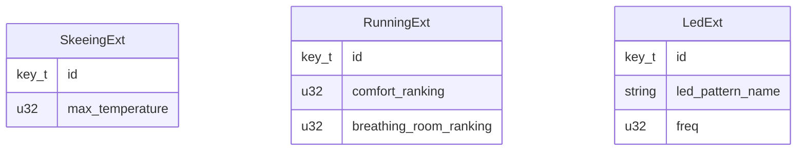
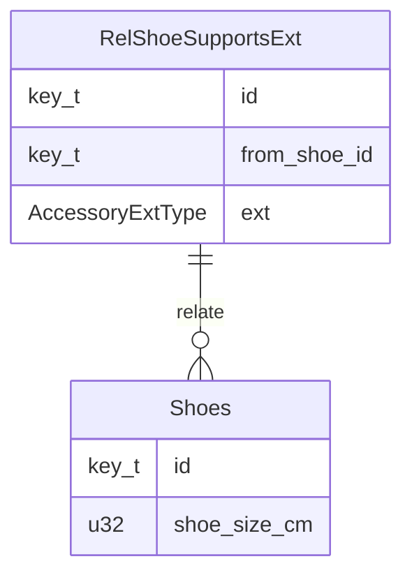
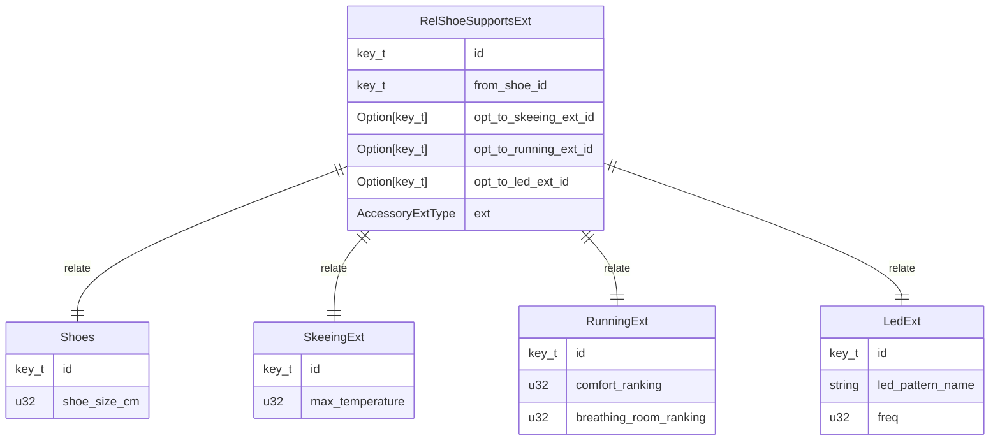

#design

# 1 Objective

To capture design considerations for the generated rust library from a dbmt schema file.

# 2 Journal

# 3 Tasks

# 4 Issues

# 5 HowTos

# 6 Investigations

# 7 Ideas

## 7.1 Feature Proposals

### 7.1.1 Tablegroup to trait


2025-08-21 Wk 34 Thu - 10:45

dbml supports table groups. We need to be able to support this too. Suppose you have three tables, `A`, `B`, and `Common` in the relationship `A <- Common -> B`. This could be implemented by the pattern where `Common` joins with every table that uses it, but this won't scale well, and now it will be modified whenever a new user shows up.

You could also implement it as `{A, B} -> Common` and this is more scalable since `Common` remains untouched while new users `{A, B, C, ...}` join a primary key from it. But this introduced fragmentation, and the chains can grow complex in time. 

With table groups, we can get the modularity at the schema level while keeping the resulting database simpler, since we will have to worry about fewer join relationships. 

We can have the Rust generated library understand table groups for any table as well. The key idea is that groups should be akin to rust traits. 

We should be able to...
- accept multiple tables into a function sharing the same group. 
- iterate through all tables sharing a group
- Implement hooks on table groups that work on all tables that share it

Tablegroups can have data access settings. The strictest setting is applied when multiple are detected.

### 7.1.2 Relationships as Traits

2025-08-21 Wk 34 Thu - 11:06

Often we have relationships between entities. Users follow other users. Users post posts. 

One way to express a relationship is as `Users <- RelPosts -> Posts`.

But even though it's a user that posts a post, it's unclear here which is the source and which is the sink. We want the user to be the source, and the post to be the sink.

Another way is to do `Source -> Relationnship -> Sink`, so that `Users -> RelPosts -> Posts`.  But there is also an issue with this. Sure the source and sink are clear now, but it could be assumed that the material composition of the user's data is a relationship, which is logically false.

Really, using `Users <- RelPosts -> Posts` is the most enclosed option, this way the tables `Users` and `Posts` remain self-encapsulated and fully material (join structures in them express only additional data and not ways of relating between data).

For this, we propose two marks, `%relation` for a table, and optionally a `%relation_source` for a column in it to signify a directed relation. 

This can also work with [[#7.1.1 Tablegroup to trait]] in that relationship tables may be divided into table groups. For example, maybe both `Users` and `Robots` can post. so we can have a `GrRelPosts` with just the sink information, a foreign key to `Posts`, and we can then create `RelUserPosts` and `RelRobotPosts` which have `Users` or `Robots` as a source, and share a common `GrRelPosts` for sink. This way we could iterate over all such relationships, like all that can post.

### 7.1.3 Configurable Extension Tables with extension compatibility rules

Similar to [[#7.1.1 Tablegroup to trait|Tablegroup to trait]],

Table extensions would create a set of all possible fully extended table types.

These are different from join supertables, because we do not want to join them but retrieve them individually as conditional fragments. This means that join structures are valid for all rows while what extensions to retrieve for a given table are row-dependent!

Consider the following case:

You have a table, `Shoes`, and your customers really love your shoes and commend you for how comfortable they are. However, some want `SkeeingShoes`, others want `Runningshoes`, and some want `LEDShoes` for children.

You realize each of these tables host different kinds of data, but they all share attributes with `Shoes`. 

Also your customers are so happy they have requested you sell 50 different types of extensions to your shoes! Some extensions go well with one another, while others you would choose only one of.

Using the proposed [[#7.1.1 Tablegroup to trait|Tablegroup to trait]] you could create a `GrShoes` table group and embed it in all of the 50 shoe extensions. That could work. But your company has many tables that depend on `Shoes` already, and it would require effort to ask everyone to maintain every possible type of shoe the customers love.

Another solution is you could add new columns. Maybe 50 columns like `opt_skeeing_shoe_type_id` , where many are set to null, and the valid extensions not set to null. Your team shrugs that you're adding many columns, but they find this better than supporting 50 tables at least.

If you opted for referencing a base `shoe_id`  in 50 different extended shoe tables, you now have 50 reverse lookups for your team to deal with when they want to go from `shoe_id` to one of 50 possible extended shoes.

And wait until the customers start asking for matching gloves for each shoe extension variant. That's 50 more.

To deal with this issue in a more scalable manner, we propose adding Extension Tables.

Define an enum type of extensions,

`AcessoryExtType` enum:

| Variant    | Meaning                                       |
| ---------- | --------------------------------------------- |
| SkeeingExt | skeeing acessory attributes                   |
| RunningExt | additional comfort and breathing room metrics |
| LedExt<br> | additional rainbow LED lighting patterns      |

Then define tables for each variant



And configure each with `%extension_enum AcessoryExtType.SkeeingExt`, `%extension_enum AcessoryExtType.RunningExt`, and `%extension_enum AcessoryExtType.LedExt`

Now give our shoes a new relation for supporting these accessories




And configure this relationship table `RelShoeSupportsExt` with `%extension AcessoryExtType`.

That's it, now automatically the 50 optional keys will be defined in `RelShoeSupportsExt`.





Notice that extension tables have no reference to where their base is. This means that this can be done again but for gloves, which makes extension tables general, and also avoids expensive reverse lookup based solutions.

Now your teams can scale. Your shoe, gloves, helmet, and glasses teams can all work with your new flashy accessory team. Your accessory team owns in their own dbmt file the enum `AccessoryExtType` and all associated tables. Your shoe, gloves, helmet, and glasses teams all just define a supports extension relationship table for `AccessoryExtType`. 

The accessory team doesn't have to make 4 requests to each department to modify their tables just to add a new flashy accessory. In code, they could also handle generally all tables that support their extensions.

Teams can design data extension workflows and allow others to add their own variants according to defined rules.

Instead of having each team worry about 50 accessory extensions, our autogenerated library can take care of this.

In addition, we can provide a set of rules that enforce extension use. For example, we do not allow duplicate or circular extensions, but the user can provide extra constraints:

```
%extension_exclusive SkeeingExt RunningExt
%extension_requires LedExt RunningExt
```

These constraints should be defined on the enum `AcessoryExtType`.

Constraints apply in the order given and can include 
- `%extension_exclusive Ext ... `, 
- `%extension_requires ExtSource ExtSinks ...`, 
- `%extensions_incompatible Ext ...`
- `%extensions_compatible Ext ...`
- `%extensions_required Ext ...`

Instead of providing each variant in `Ext`, you can also just say `ALL_EXTS`.  This will be a reserved keyword.

For `%extensions_incompatible` it would provide a combination that should be illegal, while `%extensions_compatible` would provide a whitelist of possible combinations explicitly.

Those could be then enforced on init, write, and read with `%extension_validate trigger ...` on the relationship table.

Another benefit of this pattern is that it provides extra constraints for our type generation. If you had 50 shoe extensions, but it was only possible to have one exclusive choice of extension, you shouldn't have Rust generate supertable combinations that violate this!

So this would reduce the number of possible supertables, from the size of the powerset of all tables [[#^calc-2-to-50|(math)]] to only 1! They will not be retrieved as supertables anymore but rather as extensions to the shoe table in Rust.

In general, the autogen code will have a safety upper limit when dealing with large combinations.

This feature could also allow some cool things like 
- each extension having a trait to allow general code to be written about any tables that include the extensions
- enumeration completeness guarantees. If an extension type enum is configured, all its variants must have extensions. 
- Feature parity guarantees over in Rust code. This can map nicely to rust's rich enum types. Any table that supports a specific extension type could be made to implement its new features against every possible variant for consistency.
- Being able to search a table for an extension that is anywhere within its extension tree without using any complicated joins.

As this diverts from standard SQL use, more design work needs to be put into how they are queried.

An example of an extension tree search is if we had the query "Give me all entities which support Rainbow LEDs" from

![[Pasted image 20250821230153.png]]

If you say you support an extension, you say you've considered every facet of it. if 2 years later you decide to add a new LED type and forgot all this, the system forces you to go consider shoes gloves, and helmets now because you have explicitly stated they support LED extensions and must consider ALL variants!

This can be used to maintain feature parity and consistency for common concepts.

# 8 Side Notes

## 8.1 Exponential explosion


Since you asked... ^calc-2-to-50


$$
2^{50} = 1125899906842624
$$


# 9 External Links

# 10 References