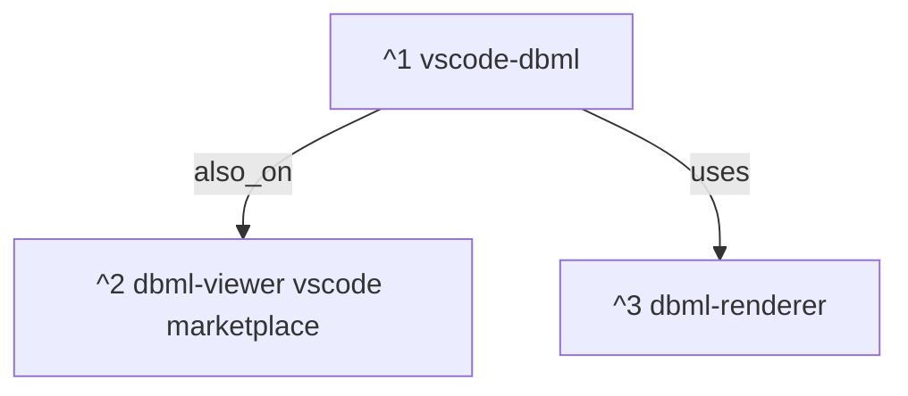

# 1 Objective

We're designing a new language [[000 Designing new language dbmt|`*.dbmt`]] . 

Every valid `*.dbml` schema is also a valid `*.dbmt` schema. `*.dbmt` is a superset of `*.dbml`. 

# 2 Journal


# 3 Tasks

## 3.1 Clone and run vscode-extension-dbml-viewer

- [ ] 

2025-08-06 Wk 32 Wed - 17:59

Following the [installation instructions](https://github.com/Durandal14/vscode-extension-dbml-viewer?tab=readme-ov-file#installation),

```sh
mkdir -p ~/src/cloned/gh/Durandal14
cd ~/src/cloned/gh/Durandal14
git clone git@github.com:Durandal14/vscode-extension-dbml-viewer.git
cd vscode-extension-dbml-viewer
```

```sh
npm install
# out
added 353 packages, and audited 354 packages in 7s

86 packages are looking for funding
  run `npm fund` for details

3 low severity vulnerabilities

To address all issues, run:
  npm audit fix

Run `npm audit` for details.
```

```sh
npm run build
```

2025-08-06 Wk 32 Wed - 18:11

This seems fine.

There's a [vsc-extension-quickstart doc](https://github.com/Durandal14/vscode-extension-dbml-viewer/blob/main/vsc-extension-quickstart.md). How do we get this running in vscode? [[#5.1 Getting local vscode extension to run in vscode|HowTo]]. ^spawn-howto-061812

2025-08-06 Wk 32 Wed - 18:29

```sh
vsce package

 ERROR  Both a .vscodeignore file and a "files" property in package.json were found. VSCE does not support combining both strategies. Either remove the .vscodeignore file or the "files" property in package.json.
```

In package.json, I found `npm run package`.

```sh
npm run package
```

### 3.1.1 Pend
# 4 Issues

# 5 HowTos

## 5.1 Getting local vscode extension to run in vscode

- [ ] 

From [[#^spawn-howto-061812]].

2025-08-06 Wk 32 Wed - 18:14

In this [stackoverflow question](https://stackoverflow.com/questions/42017617/how-can-i-install-vs-code-extension-manually) they are recommending I install from VSIX, but in my case there is no such file.

2025-08-06 Wk 32 Wed - 18:25

From this [blog post](https://mehmetbaykar.com/posts/how-to-install-vscode-extension-from-your-custom-or-local-repo/),

```sh
npm install -g @vscode/vsce
npm install       # install dependencies
vsce package      # package the extension as .vsix
```


### 5.1.1 Pend

# 6 References

1. [vscode-dbml](https://github.com/Durandal14/vscode-extension-dbml-viewer) ^1
2. [dbml-viewer vscode marketplace](https://marketplace.visualstudio.com/items?itemName=nicolas-liger.dbml-viewer) ^2
3. [gh softwaretechnik-berlin/dbml-renderer](https://github.com/softwaretechnik-berlin/dbml-renderer/) ^3



