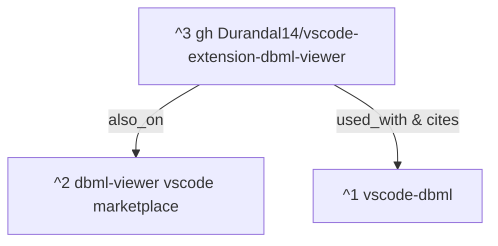

# 1 Objective

We're designing a new language [[000 Designing new language dbmn|`*.dbmn`]] . 

The 

# 2 References

[vscode-dbml](https://github.com/Durandal14/vscode-extension-dbml-viewer/blob/HEAD/vscode:extension/matt-meyers.vscode-dbml "https://github.com/Durandal14/vscode-extension-dbml-viewer/blob/HEAD/vscode:extension/matt-meyers.vscode-dbml") ^1
[dbml-viewer vscode marketplace](https://marketplace.visualstudio.com/items?itemName=nicolas-liger.dbml-viewer) ^2
[gh Durandal14/vscode-extension-dbml-viewer](https://github.com/Durandal14/vscode-extension-dbml-viewer) ^3

