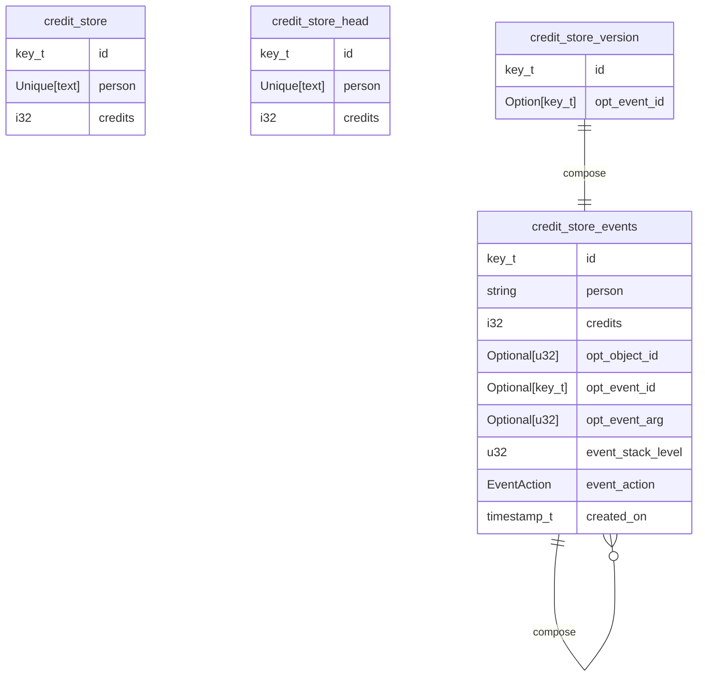
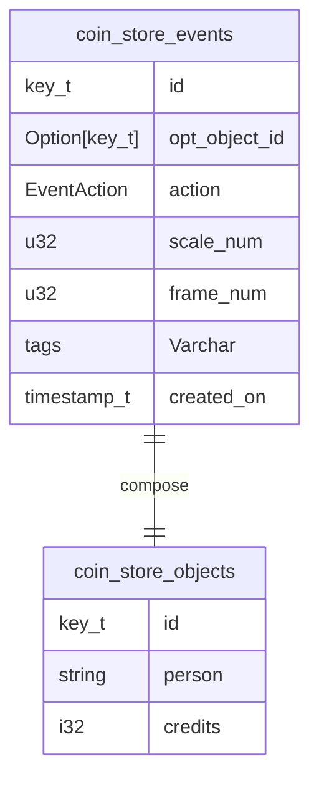

Parent: [[000 Implement the Event Accumulator]]

Spawned by: [[000 Implement the Event Accumulator]] 

Spawned in: [[000 Implement the Event Accumulator#^spawn-task-9b8a2b|^spawn-task-9b8a2b]]

# 1 Journal

2025-09-21 Wk 38 Sun - 23:21 +03:00

Currently our schema for credit is

And our actions are:

| Event Action    | Description                                                                                           |
| --------------- | ----------------------------------------------------------------------------------------------------- |
| insert `ID`     | Insert a new object with a new `object_id`.                                                           |
| update `ID`     | Set the new values for an existing `object_id`                                                        |
| delete `ID`     | Delete an object given by `object_id`                                                                 |
| pop             | Objects state returns to previous `event_lifetime`                                                    |
| reset           | Delete all objects.                                                                                   |
| init            | Set the initial state from a base table                                                               |
| undo `N` [`ID`] | undo the last `N` changes. Optionally, an `object_id` can be given to undo only its last `N` changes. |
| redo `N` [`ID`] | Cancels an `undo` or acts as no-op otherwise.                                                         |
| seek `EID`      | Seeks an event id, overwriting all object states with that version                                    |

2025-09-22 Wk 39 Mon - 00:13 +03:00

All this needs to be simplified. No seeks or undos or redos or pops. And events can be local if they include an object, or global if they do not.

With actions

| Event Action    | Description                                                                                           |
| --------------- | ----------------------------------------------------------------------------------------------------- |
| insert `OID`    | Insert a new object with a new `object_id`.                                                           |
| update `OID`    | Set the new values for an existing `object_id`                                                        |
| delete `OID`    | Delete an object given by `object_id`                                                                 |
| frame `s` `f`   | Frame events create a new frame with scale `s` and frame no `f`                                       |

